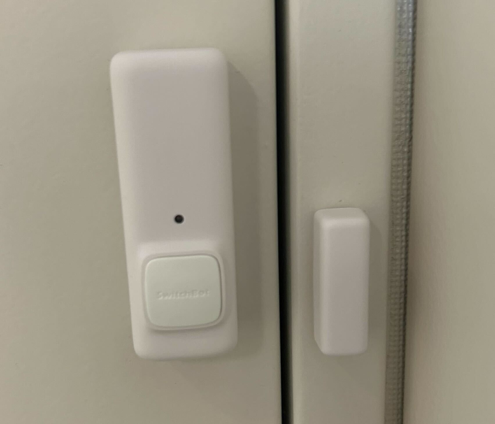

# door_adapter_switchbot

Open-RMF door adapter implementation for manual doors with [SwitchBot Contact Sensor](https://www.switch-bot.com/products/contact-sensor) attached. Door status will be notified by this adapter but the doors should be opened manually.

<table>
  <tr>
    <td></td>
    <td></td>
  </tr>
</table>

## Installation

```bash
cd ~/colcon_ws/src
git clone git@github.com:sbgisen/door_adapter_switchbot.git
pip install -r door_adapter_switchbot/door_adapter_switchbot/requirements.txt
cd ~/colcon_ws && colcon build
```

## Update config.yaml

For each door, create a corresponding `config.yaml` file containing important parameters for setting up the door adapter. See [this file](door_adapter_switchbot/config_template.yaml) for template.

<!-- TODO: detailed instruction -->

## Run the door adapter

One adapter should be run for each door used inside the building managed by the Open-RMF system.

Run the command below while passing the paths to the configuration file to operate on. See [here](https://support.switch-bot.com/hc/ja/articles/12822710195351-%E3%83%88%E3%83%BC%E3%82%AF%E3%83%B3%E3%81%AE%E5%8F%96%E5%BE%97%E6%96%B9%E6%B3%95) to get the switchbot token and secret values.

```bash
export SWITCHBOT_TOKEN=<token>
export SWITCHBOT_SECRET=<secret>
ros2 run door_adapter door_adapter -c CONFIG_FILE
```
